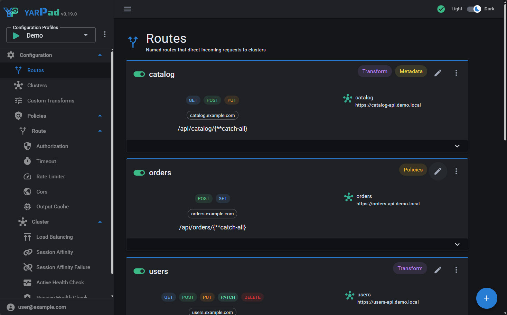
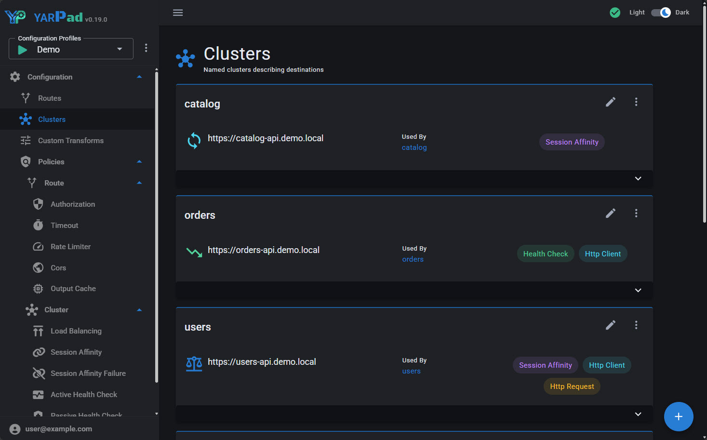
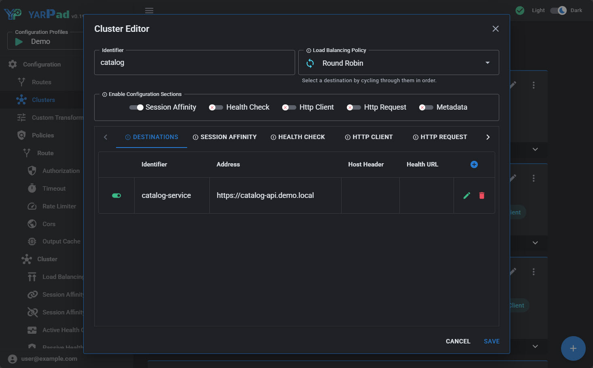
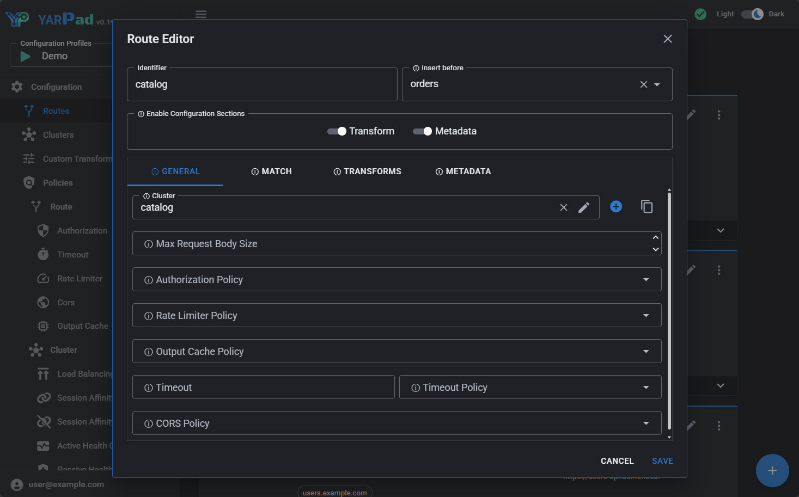

# YARPad Screenshots

_Routes — named routes directing incoming requests to clusters_

_Clusters — named clusters describing upstream destinations_

_Cluster Editor — configure destinations, load balancing, health checks, and more_

_Route Editor — configure cluster, policies, matching, transforms and metadata_
